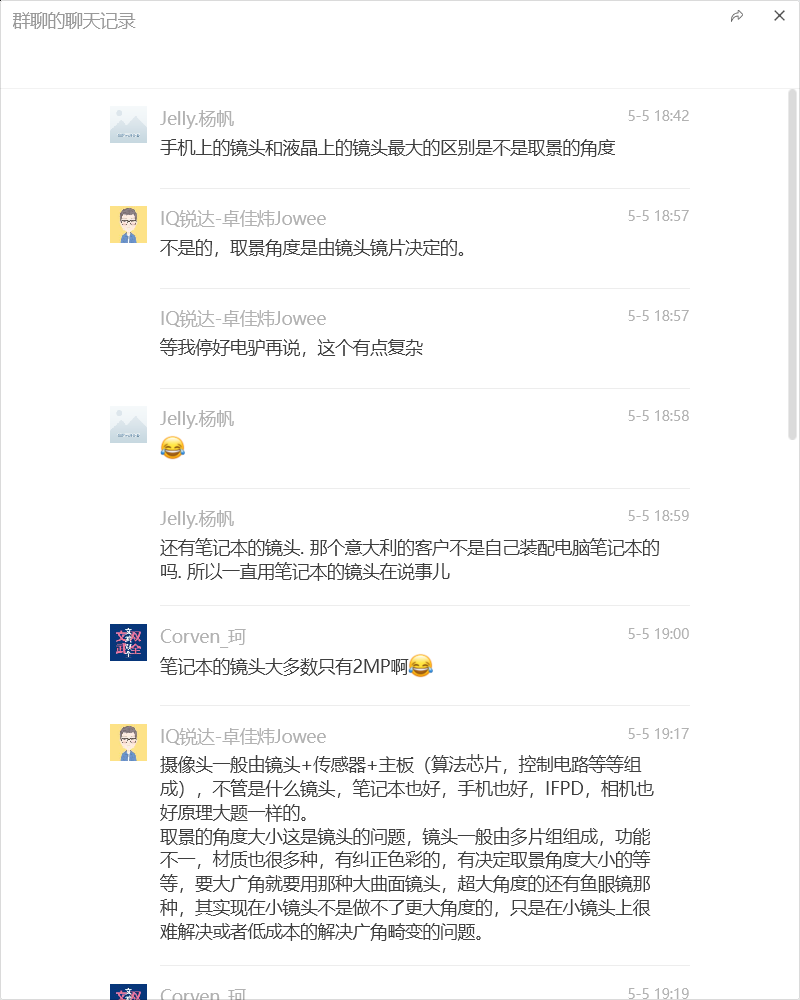
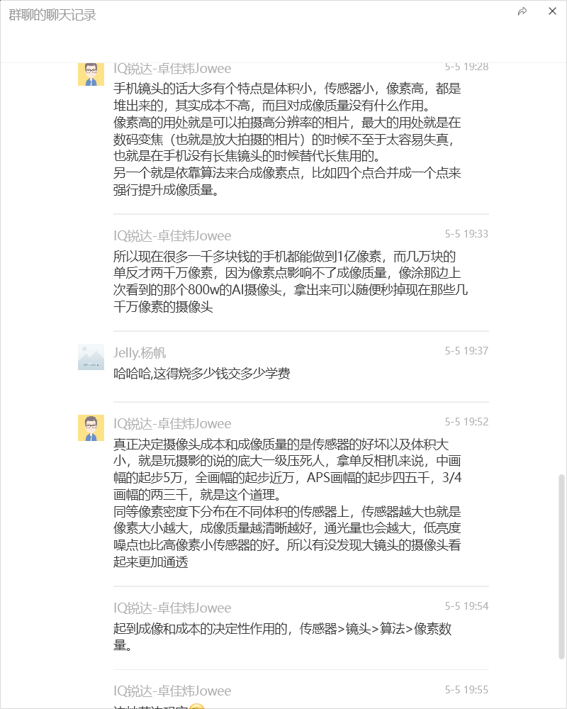

# IQ-答业务问

[toc]

## Document Camera

### IQView展台画面延迟(在4K下)

IQView展台画面延迟事件目前进展：

1. 测试结论汇总：
   - 跟OPS配置有关：配置越高的OPS延迟越低；（内存强相关，CPU弱相关，SSD必备） 
   - 跟大屏本身的屏幕分辨率有关：2K分辨率下延迟明显低于4K分辨率；
   - 跟展台画面的分辨率有关：2K分辨率下延迟明显低于4K分辨率；
   - 跟软件有关，Windows自带的Camera应用在各条件测试下表现都良好，极限状况（低配OPS，4K屏幕分辨率，展台4K画面）下存在轻微延迟，但属于可接受的状态；IQView仅在高配OPS，2K屏幕分辨率，展台2K画面下表现流畅，其他情况下皆有不同程度的延迟；竞品软件有测试Visualizer，同样测试环境下表现低于Windows自带Camera软件，明显好于IQView；
2. 客户反应的延迟情况，已模拟环境测试（低配OPS，4K屏幕分辨率，展台2K，IQView最新版），结果是可以复现的（2s多的延迟，展台调成4K的话3s多）
3. 解决思路：
   - 已交代开发排查优化IQView代码；
   - 同时在测试麦哲的一款中性展台软件，看看效果如何，如果合适且IQView问题无法快速解决的话作为Plan B 备选；

4. 事件复盘：
   - 下订单前业务不知情，得到的反馈信息也是这个配置的OPS没问题；
   - 出货测试由于此次只是出货大屏+OPS，所以没做整体方案的测试，只是测试了大屏+OPS；OPS本身不存在故障或明显卡顿，配合大屏使用也正常；

5. 后续改进：
   - 涉及到整体销售方案或展会方案的订单，业务人员提前告知技服团队，技服团队会在出货前安排整体方案测试，将问题前置；
   - 自研软硬件方面：测试用例中需添加公司常见销售方案以及客户常见使用场景进行组合测试，保持品牌内生态的连续性和完整性；同时也是提升品牌形象及软实力的重要一步

## LCS

### 拾音与拓音

> https://kimi.moonshot.cn/chat/cqga53g3r076limltkj0
>
> https://chatgpt.com/c/c4bca124-4528-4f4b-88bc-830fe4b63fa8

**问题核心：** 客户将S610等吊顶麦克风误认为既能扩音又能录音，导致产品定位不清，影响销售和项目落地。

> A: 市场部帮忙想一下把s610的名称改一下，s610主要是录音麦克风，不能作为扩音用,现在的客户都在把这个麦混用到本地扩音中，业务解释不清楚，后期会给项目落地带来很多麻烦
>
> B: S610我们给的产品名也是麦克风，没有提到能做speaker用，为啥客户会混淆
>
> A: 麦克风一般都优先会认为是扩声可以用，就好比手持麦，鹅颈麦;吸顶麦也会分可本地扩音麦，和只能远程视频会议用的麦,这是有区别的.
>
> A: 手持麦，鹅颈麦是既可扩音也可收音录制，因为是指向型的，而且收音距离短，它们不用担心扩音的同时又被录制，然后让录音产生回音;
>
> A: 但是吊顶麦拾音距离长，要想既扩音又收音录制是很难的，对音频处理的要求很高。。。我们现在的s610只能做到拾音，所以这一点要在营销工具里写清楚
>
> B: 那LCS710的吊麦不会有这个问题是吗
>
> A: 一样的，也只能录音，不能扩音. s600是可以扩音的，而能扩音的一般也都能用于录制
>
> B: 那如果客户对录播系统既有扩音也有收音的需求，我们是推荐S600吗
>
> A: 看情况定，有很多选择。 先把录播标配的麦的描述规范一下
>
> B: 我发现S600我们也是叫做麦克风，只是描述里面有增加了扩音的描述，这样的话，确实得把两款的名称区别开
>
> B: "Dedicated Channels for speech reinforcement and recording: Our comprehensive solution employs audio volume stabilisation and clear audio processing to produce sharp recordings. The MAS-A100 has two channel outputs. The main channel provides speech reinforcement in a classroom environmnet, while the dedicated rec channel records with a wider capture range and optimal ingelligibility - perfect for lecture capture and remote learning*. The dual output channel enables ture hybird learning by providing speech reinforcemnt in the classroom, and recording for remote learning simultaneously, to create a ture bybrid learning solution." 你说的既能扩音也能收音，是这个意思吗？
>
> A: 嗯，这个是既能扩音也能收音
>
> B: “Note: This ceiling microphone is not suitable for local speech reinforcement. For project requirements regarding speech reinforcement, please consult our technical team for further advice." 在LCS710PRO的参数表里把麦克风的描述改掉，底部再加一行说明，这样看下行不行；考虑到客户对录播的需求不会都要求有扩音，我们在LCS710PRO的彩页里就不对麦克风做过多说明；如果是单纯需要S610这款麦克风的客户，有单独的彩页，在S610的彩页里我们也加上那行note
>
> A：我想说能不能再醒目点，你在feature里增加一个这款麦克风适用于课程录音和远程视频会议。适合于搭配录播系统用于课程录音，以及视频会议。

我现在对于扩音和收音录制不是很了解。 他们说录音的过程需要收音，收音就是把周围声音都收纳进来，这时候再做扩音，如果没有处理，则扩出去的音还会再次被收纳进来，再次被扩音出去，因此需要产品对音源声道进行处理。

这段对话主要讨论的是关于不同类型麦克风的使用场景和功能，以及如何避免使用不当导致的技术问题。让我来帮你解释一下：

1. **收音（拾音）**：这是指麦克风捕捉周围的声音。麦克风可以是指向性的，只捕捉特定方向的声音；也可以是全向性的，捕捉来自各个方向的声音。
2. **扩音**：这是指通过扬声器放大声音，让更多人能够听到。扩音系统需要确保声音清晰，没有回音或噪音。
3. **回音问题**：如果一个麦克风同时用于收音和扩音，那么扩音出去的声音可能会再次被麦克风捕捉，然后再被放大，形成回音。这通常需要通过音频处理技术来避免。
4. **S610麦克风**：根据对话内容，S610是一款主要设计用于录音的麦克风，它可能没有设计用于扩音。客户可能因为它是麦克风而误以为它可以用于扩音。
5. **S600麦克风**：与S610不同，S600既能用于扩音也能用于录音。这种类型的麦克风在设计时会考虑到避免回音问题。
6. **LCS710吊麦**：虽然对话中没有详细说明，但从上下文推测，LCS710可能和S610类似，主要用于录音，不适用于扩音。
7. **产品描述规范**：为了避免客户混淆，需要在营销材料中明确指出每种麦克风的用途和功能限制。
8. **客户选择**：如果客户需要一个既能扩音又能录音的系统，可能需要推荐S600或其他具有这种双重功能的设备。

**扩音和收音录制的基本概念**

1. **收音（拾音）**：
   - **定义**：收音是通过麦克风将环境中的声音转换为电信号。这个过程会将周围的声音都捕捉进来。
   - **用途**：用于录音设备、视频会议系统等。
2. **扩音**：
   - **定义**：扩音是将麦克风捕捉到的声音信号通过扬声器放大，使其传播到更大的范围。
   - **用途**：用于公共演讲、会议室扩声系统等。

当一个系统同时进行收音和扩音时，会面临一些挑战：

- **回声**(Echo)：当声音通过麦克风收录后，经过扬声器放大，再次被麦克风收录，形成回声。这种现象会让录音和扩音质量变差。
- **反馈**（Feedback）：当扬声器的声音被麦克风收录后，再次放大，形成一个自激振荡回路，产生刺耳的噪音（啸叫）。

**处理方法**

1. **回声消除（Echo Cancellation）**：检测并消除从扬声器返回到麦克风的声音，避免回声干扰。
2. **反馈抑制（Feedback Suppression）**：通过算法检测和抑制自激振荡，避免啸叫声。
3. **双声道处理**：将扩音和录音分成两个独立的声道处理。一个声道用于本地扩音，另一个声道用于远程录音或视频会议。这样可以确保扩音时不会影响录音的质量。

在讨论中提到的产品中：

- **S610 和 LCS710**：只能用于录音，无法进行扩音。
- **S600**：可以同时扩音和录音，但需要确保音频处理技术足够先进，以避免回声和反馈问题。

## IFP 

### 1. 需要有 analog 音频输出对接到第三方的PA

 

请问下，TE13, TE1200PRO, TB, HA,我们这几款都没有analog 音频口的，是么？然后可以用哪个音频口完全替代功能呢？

答案是可以.

## 摄像头

### 摄像头模组的对比

**Q1: 手机镜头和液晶上的镜头在取景角度上有什么区别？**

- **A1:** 取景角度由镜头镜片决定，而不是设备类型决定的。取景角度主要取决于镜头的结构和设计。

**Q2: 笔记本电脑的摄像头一般有多少像素？**

- **A2:** 笔记本摄像头通常只有2MP左右，不如手机的高像素摄像头。

**Q3: 镜头的角度与焦距有什么关系？**

- **A3:** 焦距影响取景角度，广角镜头通常有较短的焦距，而长焦镜头则有较长的焦距。要获得广角效果，需使用曲面镜头或超大角度的镜片设计，而不仅仅是缩小镜头尺寸。

**Q4: 为什么手机摄像头的体积小、像素高，但成像质量不一定高？**

- **A4:** 手机摄像头体积小、像素高，主要通过高密度像素的排列实现。但由于传感器和镜头尺寸较小，像素虽多但感光性能有限。因此，虽然像素高，但成像质量受限。

**Q5: 为什么现在手机的像素动辄上亿，而专业相机像素相对较低？**

- **A5:** 手机摄像头采用高像素是为了放大照片时细节不易丢失，但像素过多会影响成像质量。而专业相机更关注传感器质量和光圈，低像素传感器通常具有更好的成像性能。

**Q6: 成像质量和成本主要由哪些因素决定？**

- **A6:** 成像质量和成本由传感器的类型、镜头的质量、算法的优化以及像素数决定。传感器质量和面积更重要，传感器越大、通光量越高，成像质量越好。

 
