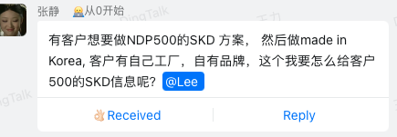
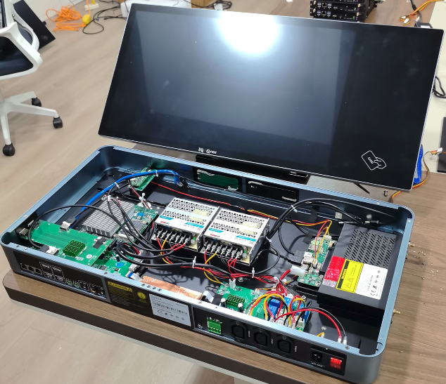

# NDP-售前问题

[toc]

# NDP500的SKD方案思路

 

SKD（Semi-Knocked Down）是指“半散件组装”方式，即产品的主要组件已经在原产地预先制造好，但未完全组装成品，而是以部分散件的形式出口到目标国家或地区，在当地进行最后的组装和测试。这种方式通常用于降低关税、符合当地法规，或利用当地的劳动力和供应链优势。

在本国组装 SKD 产品，意味着你们在本国接收部分组装好的产品组件（如机壳、电路板、模块等），然后在当地进行最终组装、测试，并可能进行少量的本地化调整，如更换电源适配器、加贴标签等。相比 CKD（Completely Knocked Down，完全散件），SKD 方式的组装复杂度较低，但仍能享受一定的本地制造政策优惠。

> 1. CKD. 是全散件. 核心是电路板要在当地生产
> 2. 现在各国对skd都有一些明确的要求. 要求高过多少比例的组件必须在当地生产才能算是SKD. 韩国应该还没有. 有不少韩国品牌甚至只是在当地更换包装就自称MADE IN KOREA

  

- 屏体部门
- 底座部分
- 还可以把OPS也拿出来分开发货. 就是三部分

# NDP机器

## 1. 电容笔能否平替

> Guys can the customer use other stylus on the podium unit. Is that a Wacom type pen. They want to know if instructors can have thier own stylus or can they get a compatible pen. 
> （美国客户）

1. MPP（Microsoft Pen Protocol）是微软的一种数字笔协议，用于支持触摸屏设备与数字笔之间的互动。
2. Wacom 生产的数字笔通常采用的是 Wacom 自有的协议，而不是 MPP 协议。不过Wacom 的一些新型号，它们可能同时支持 MPP 协议、Wacom 协议以及其他第三方协议。
3. 你可以跟用户提一提 Surface（微软平板）那个笔是可以用，Wacom的需要看能否支持 MPP，如果支持可以用，但是由于缺少出厂前的调试校验，可能用起来没那么流畅

