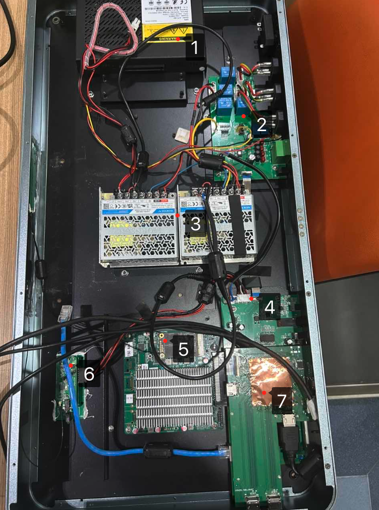
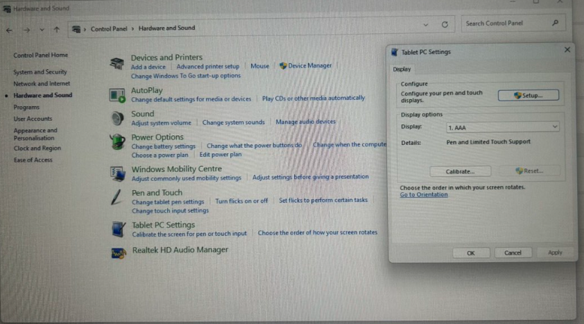
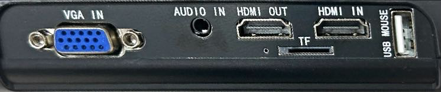

# NDP-Checklist

[toc]

# NDP机器

## 0. 内部核心组件一览图

  

| No.  | Item       | Desc |
| ---- | ---------- | ---- |
| 1    | OPS        |      |
| 2    | 电源主板   |      |
| 3    | 开关电源   |      |
| 4    | 音频主板   |      |
| 5    | 核心板     |      |
| 6    | 无线麦克风 |      |
| 7    | 矩阵板     |      |

## 1. 屏幕没有画面

> 陈利的NDP500售后，原先因屏幕无法显示输入源画面判断是内部矩阵板故障，寄新的给客户替换后，客户反馈问题依旧存在，输入源画面无法显示，甚至OUTA和B都没有画面；通过OPS直连输出至NDP500的屏，也只有一开始有画面，后面都是一片漆黑（具体可以看视频）
>
> 这台最后的方案是，我们给客户换了一台新的机器，旧的由于运费等原因太贵， 我们寄了一套板卡出去，指导客户拆卸安装，如果能安装成功 折价给客户 

1. 判断是否是输入源兼容性等问题

   - 让客户外接一台Laptop，通过矩阵切换把中屏内容切换到 Laptop 上是否正常。

2. 判断是否是OPS的尾卡出故障

   - 让客户开机箱，OPS直接外接到外置显示器是否正常

3. 判断NDP的视频矩阵卡是否出问题

   - Laptop直接接入NDP500屏幕，观察能否在中屏正常显示
   - 或者: 内置OPS直接外接到外置显示器是否正常显示
   - 如果能正常显示，则可以进一步定位 视频矩阵卡 

4. 判断是中屏故障

   - Laptop直接接入NDP500屏幕，如正常显示说明中屏无故障；若不不正常则进一步验证中屏是否正常
   - 该和方法1不同的是，方法1需要经过NMP的矩阵版

5. OPS分辨率问题

   有时候显示器读取OPS分辨率出错导致不能正常显示，可以让OPS接入外置显示器，说动调整分辨率为一个固定的分辨率，再接入中屏。

6. 内部板卡虚焊等问题：

   正常显分辨率是自适应的 ，但是目前观察到NDP500的分辨率有时候会跳动， 如三楼有时候会1980 * 1200，重启之后发现这个分辨率又不见了。这种情况可能是内部虚焊，芯片等问题导致 阻抗匹配混乱，这种情况非常复杂，最好的办法是客户寄回机器或者工程师到现场检测。

## 2. NDP支持4K输出吗

> 2024-10： 香港客户来公司参加培训提出该问题

1. 同屏模式下最高只支持1080p。

   矩阵芯片会根据几个OUT口的分辨率，选择最低分辨率的那个口做标准往几个OUT口输出画面。

2. 异屏模式下，HDMI OUT B支持4K输出。

## 3. 触摸屏书写不准确

> 陈利墨西哥NDP500售后——触摸屏书写不准确
>
> 2024-11-28

用windows自带的校准重新定位下（**校准时最好用电容笔，定位比较准**）:

 

要打开 Windows 自带的校准工具页面（如图片中所示），可以按照以下步骤操作：

### Option 1: Access via Control Panel

1. **Open Control Panel**:
   - Press `Win + R`, type `control`, and press Enter.
   - Alternatively, search for "Control Panel" in the Windows search bar.
2. **Go to Hardware and Sound**:
   - In the Control Panel, click on **Hardware and Sound**.
3. **Find Tablet PC Settings**:
   - Scroll down and look for **Tablet PC Settings** under the "Hardware and Sound" section.
   - Click on it to open the settings window where you can configure the touch and pen calibration.

------

### Option 2: Access via Windows Search

1. **Search for Tablet PC Settings**:
   - Press `Win + S` or click the search bar.
   - Type **"Tablet PC Settings"** and click on the result.
2. This will take you directly to the settings window.

------

### Option 3: Access via Settings App

1. **Open Settings**:
   - Press `Win + I` to open the **Settings** app.
2. **Navigate to Display Settings**:
   - Go to **System > Display**.
   - Scroll down to find options for calibrating touch or pen input, though these may redirect you to the Control Panel.

------

### For Calibration

1. Once you’re in the **Tablet PC Settings**, click on the **Calibrate** button under the "Display options" section.
2. Follow the on-screen instructions to recalibrate the touch or pen input.
3. **It is recommended to use a capative pen during the calibration process for more accureate positioning**.

# Peripheral

## 1). 展台

### 1. 中屏内容切到展台，显示格式不支持

- 中屏内容切到展台，其实格式不支持，然后蓝屏。

  很大原因是展台的输出被设置成了4K,而中屏最高只能支持1080P。使用展台遥控器设置输出分辨率为正确数值即可。

### 2. 展台接入NDP无信号

- 检查HDMI Cable接入展台的那一端是否接的是HDMI OUT 

  > 有时候客户接入的是HDMI IN导致无法输出展台信号给NDP
  >
  >  

- 啊啊啊

