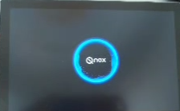
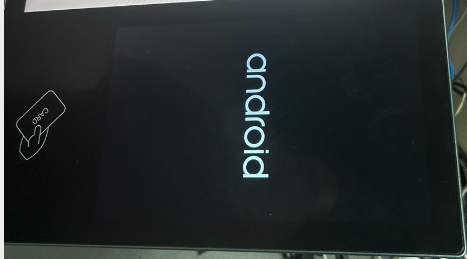
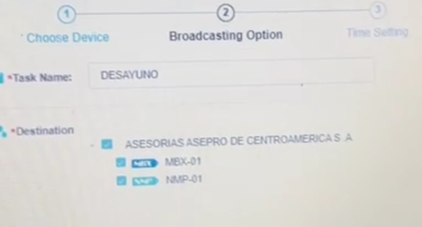
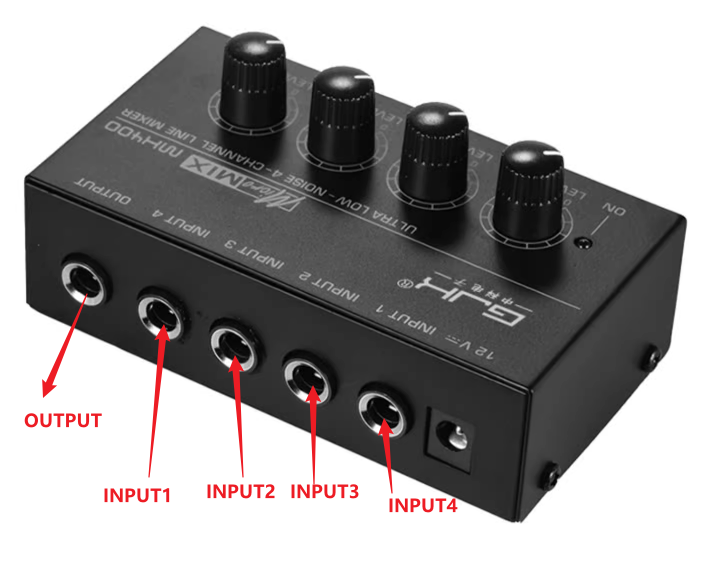
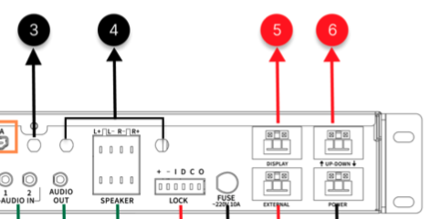
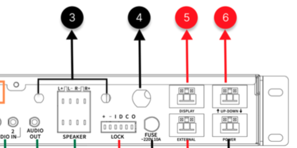

# Q-NEX答业务问

[toc]

## 一、 中性与私有部署

### Touch Panel开机Logo自定义

 

问：我们自己Qnex的所有东西，包括NDP500+NPS+NMP的控制面板开机logo，客户想用自己logo替换可以吗？

答：

技术上可以做，只需要按照规定的图形大小、格式和数量提交给厂家就可以，让厂家打包一个新的APK出来给我们。

但是这个过程厂家需要抽出专门的人处理，并且APK打包完毕之后需要我们这边测试团队做一次测试保证稳定性才能出去。因此整个过程消耗人天较大。

结论是：

有产品订购量可以做，没有量不适合频繁调动厂家的人处理，建议用我们的中性版本（开机Logo显示安卓操作系统自带的Logo）

备注： 

中性开机LOGO如图所示：

 

## 二、 设备广播与推流

### NMP在百兆宽带下播放1080p视频开头丢帧严重

| Key      | Value                                                        |
| -------- | ------------------------------------------------------------ |
| 时间     | 2024-6-08                                                    |
| 客户     | 张金客户                                                     |
| 反馈方式 | 钉钉-QNEX售后群                                              |
| 客户环境 | 客户测试环境是百兆  |
| 播放设备 | NMP、MXB  |
|          |                                                              |

问：

- 张金客户测广播1080P视频，反馈说一开始画面丢失，播不出来；感觉这个画面帧丢失的有点太久了，跟什么有关系呢？（客户买了lite media server）
- 能知道大概多少兆的宽带播放才会顺畅么，至少让客户给他的客户演示时别翻车

答（陈日良）：

- 播放时显示图像有两种，一种10S后出图像，一种3S出图像，在后台要设置同步优先还是播放速度优先，同步优先出图像10S左右;
- 由于网络延时，存在媒体服务器与设备播放有时间差，我们设备属于即时播放，这个时间差就会导致第一帧视频有缺失花屏，属于正常现象;
- 在网络通畅下广播出图像的时间是固定3S与10S，如果网络通信不畅时间会延长甚至无法播放

---

- 因为网络就跟我们高速路一样，100兆好比我们能通行100辆车，现在客户已经有90辆车在跑，那给广播分配的就只有10辆，所以看着100兆但实际能分配带要小很多很多，这个就我们经常遇到家里宽带晚上比较慢，白天用的少跑的快一些

- 正常1080P广播消耗15-50Mbps，广播时刚开始属于全帧广播，就是每一帧都是一整张视频，后续是差分帧，所以前面几帧会消耗高达50Mbps，后续就会逐渐小了。

  > For a standard 1080P broadcast, the bandwidth consumption ranges from 15-50Mbps per device per classroom. At the beginning of the broadcast, it operates with full-frame transmission, where each frame contains a complete video image. Subsequently, it transitions to differential frames, which only transmit the changes between frames. As a result, the initial frames may consume up to 50Mbps, but the bandwidth usage gradually decreases over time.

- 100M的办公网络，按照现在的网页，各种APP应用，会比较拥堵的，我们浏览一个h5带视频网页几十上百兆的，一般实际工程中，**办公网跟设备网是划分开的**

### NMP设备使用的带宽容量如何？

- 用户通过网络进行设备控制的流量很小（约几KB），普通带宽是足够的。

  广播功能所需带宽根据视频清晰度而定，具体如下：

  the media server is deployed in school LAN, for pushing av contents to NMP, it requires 2M bandwidth for 720P video to each NMP, and 4M bandwidth for 1080P video to each NMP, all under local area network.

  举例：学校需要广播1080P视频到10间教室，需要至少40M的带宽且广播时网络没有被其他设备占用。

### 同一个校园网有不同的网段的时候怎么实现广播功能.

可参考Q-NEX网络结构图。

在校园网的一级路由器下接入Q-NEX广播专用的媒体服务器，NMP和MBX都接在该路由器搭建的局域网下，当接收到来自Q-NEX Console的广播指令后，媒体服务器将存储的音视频内容分发到局域网内的NMP和MBX上。

### NMP 能和IP摄像头连接并实现视频推流吗?

IP摄像头和NMP没有必然的关联，IP摄像头通过网络推流，可利用NMP的交换机接口接入网络。

### Q-NEX AV distribution是 AV over IP？

Q-NEX的广播是符合AV over IP的定义的。

什么是AV over IP？AV over IP代表“基于互联网协议的音视频技术”。

本质上来讲,它是通过LAN,WAN或互联网等网络来传输数字音视频数据。Q-NEX的广播就是把音视频内容以及直播流媒体通过网络连接方式在局域网内传输。

### media server 和 cloud server 之间的关系

media server 和 cloud server 之间的关系是什么?在整个方案中除了储存还有什么功能?

详见Q-NEX网络结构说明文档。
\\192.168.10.168\iq-国际事业部\4.跨部门共享区\1.售前支持\3. 售前技术支持\Q-NEX知识库

## 三、设备集控

### NMP对液晶进行控制是否有品牌的要求？

没有要求，只要现有的IFP/Projector/TV有HDMI端口即可，除了HDMI 口，只要液晶设备支持RS232或者IR，亦可实现设备通过网络开关机

### 是否支持HD base T？

暂不支持。

HDbaseT 1.0支持最高20Gbps的传输速率，能完美地支持FULL 3D和4K/ 2K视频格式，传输采用普通的CAT5e/6网络线缆进行无压缩传输，连接器也采用普通的 RJ45接头，而传输距离达到了100米，此外，还提供以太网功能、100W的供电能力（PoE）和其他控制信号通道。

简单理解的话，HDbaseT是指HDMI信号通过网口传输。

### 是否支持NDI？

暂不支持。NDI是Network Device Interface的简称，是由美国NewTek公司于2015年推出的网络设备接口协议;

NDI是采用HDBaseT标准以数字高速以太网传输技术；

NDI是采用数字高清以太网传输技术，将前端采集类设备(NDI数字高清摄像机)通过CAT5或CAT6网线点对点直接连接，再通过网络数据链路层把未压缩的实时数字高清信号经过高效的组织排序发送给接收端NDI分析类设备(DVR、压缩卡、中继器、光端机等)，从而实现等同SDI的传输效果；

HD-NDI的传输相比用同轴电缆传输会更有价格优势，更稳定，抗干扰能力更强。而且在传输视频信号的同时可以实现实时，双向音频，双向控制信号等的传输，还可以使用以太网供电(POE)技术，从而降低使用成本及节省了布线成本。

### 关于 NMP 的固件升级

NMP固件出厂之后非必要不升级。

如果需要调试Q-NEX系统，我们会先征询合作伙伴的意见，约定一个方便的时间在线进行设备升级。如果需要，我们也可以只选择部分设备或所有设备同时升级。

智能面板固件支持联网OTA升级。

### NMP的电源用的是什么接口

电源是德国标准的WAGO端口，1路进，2路出以及一路SPDT切换。

注意：“DISPLAY”和“SCREEN”端口的输出功率保持在1200W以下。

并且“外部”（SPDT）开关的载流能力不应超过1200W。

### 教室IP画面怎么推给其他教室

如果老师在一个教室用IP摄像头拍摄上课画面，他怎样能把画面广播给其他教室？（这个问题主要是客户以为ip cam可以通过nmp直接推流到其他教室）

IP摄像头把媒体服务器的ip地址填写到它的设置后台，通过推流，由媒体服务器把camera的直播画面推送到指定的安装了NMP或者MBX设备的教室中去。NMP或者MBX只接收视频流，ip摄像头不能通过nmp或者mbx推流。

### 支持把学校已投入使用ID卡用到NMP刷卡系统中吗？

只要学生的ID卡是符合我们要求的卡型号（m1-s50卡，频率13.56mhz），就可以用，即一卡可以同时适用于多套系统，既适用于学生考勤卡系统，又适用于我们Q-NEX的卡系统

### NMP 能储存内容吗?

NMP不提供用户端的内容储存功能。

### IR 线如何和空调连接并实现控制?

NMP有提供一个IR接口，标配会带一根红外发射器的线，将线的一头接到NMP上，另一头的发射器靠近并对准空调，其原理跟红外遥控器是一样的。具体操作可参看NMP的安装视频即可了解。

### NMP的输入功率是多少？

通常我们提供的是NMP的输出功率，而输入功率是指输入电压与输入电流的乘积，输入电压一般根据不同国家有一个相对恒定的值，输入电流又根据设备的运作而变化，对我们的nmp来说是个无意义的参数，所以这里客户可能是想要知道nmp能支持的输入电压是多少，可以告诉客户Nmp是支持宽电压的，范围是85-264V。

## 四、 竞品与集成

### 与第三方系统（如 Crestron)的集成

> Do you know if Q-NEX can also talk/integrate to other control systems like Crestron?
>
> - 鸿江、何凯

集成可以分为两种情况：

1. **Q-NEX主动集成Crestron**
   - 这种方式需要Crestron开放他们的私有协议。即使协议开放，我们也需要投入大量工作来适配，所以实现起来非常困难。
2. **Crestron主动集成Q-NEX**
   - **2.1 控制类API**：Q-NEX目前已经开放了部分控制类的API，使用这些API可以控制Q-NEX设备。
   - **2.2 配置类功能**：目前没有开放，比如设置NMP上的RS232端口控制哪种设备（例如IFP或PTZ摄像机），这种配置只能通过登录Q-NEX后台完成。
   - **2.3 第三方开发能力要求**：如果第三方要集成Q-NEX，需要有自己的开发能力，在他们的平台上完成对接工作。
   - **2.4 API申请流程**：需要向杨总申请API权限，批准后再由开发团队提供相关接口文档。

1. **Q-NEX integrating with Crestron**
   - This approach would requre Crestron to open up their proprietary protocol.
   - It would require a significant amount of work on our side to adapte, making it a chanllenging option to implement.
2. **Crestron integrating with Q-NEX**
   - **2.1 Control APIs:** Q-NEX currently provides some control APIs that allow integration partners to manage Q-NEX devices.
   - **2.2 Configuration Features:** However, configuration APIs are not available. For example, setting which device type (e.g., IFP or PTZ camera) to control through the RS232 port on NMP can only be done via the Q-NEX backend, not through the API.
   - **2.3 Third-party Development Requrement:** If a third party wants to integrate with Q-NEX, they need to have development capabilities and create the integration on their own platform.

### NMP/NDP如何集成第三方Mic系统

 

问的NDP100 能不能跟他们现有的麦克风系统兼容··，这个需要通过什么信息来确认

外接麦克风系统接入方法：@张静
（前提：智能讲台的鹅颈麦已经占用了NMP的6.35mm MIC IN接口）

1. 方法一：接入NMP的audio in 1/2，但使用时需在智能面板上切换对应音频通道。例如，麦克风系统接了audio in1，智能面板上需切换至audio in1才会有声音，也可控制音量大小

2. 方法二：外购一个迷你混音器（如下图），将MIC IN口分出来给麦克风系统接入。MIC IN接口为混音输入的即插即用接口，无需像方法一那样需要切换，更方便使用。

    

### MBX 和数字标牌的主要区别是什么?

mbx是作为Q-NEX校园方案系统里的一部分存在的，它的价值在于给智慧校园提供辅助广播功能，是NMP的补充，为教室以外的地方的显示设备提供广播，直播和简单的设备控制功能，它与NMP共用一个管理平台。它与数字标牌的功能相近，但是mbx有集成功放，IR及RS232控制接口，还有一个hdmi in及hdmi out接口，除了接收网络广播以外，也能切换并播放本地的电视盒子的内容。

竞品对比请查看文档-MBX培训（含竞品对比） 20210315

\\192.168.10.168\iq-国际事业部\4.跨部门共享区\1.售前支持\3. 售前技术支持\Q-NEX知识库\3.培训课件

## 五、麦克风

### 1. 多套麦克风如何不串频

- > NMP自带的无线麦克风怎么能保证两间相邻的教室之间不会串频？

  NMP的无线麦克风采用 UHF 配对及传输。麦克风的接收器内置在NMP里面，每个麦克风有24个通道可切换，相邻教室的无线麦会设置不同的通道；

  麦克风与NMP的配对距离为0.5米内，加上教室之间墙的阻隔，基本上很难出现串频的现象。

  此外，哪怕相近教室的老师同时在对频，接收器也会优先对频信号更强，对频距离更短的本地教室的麦克风。

### 2. 一个教室什么种类的麦克风?

NMP标配一拖二的无线麦克风，采用UHF对频&传输，配备的领夹麦老师用，手持麦用于学生回答问题。此外，NMP也可以支持接入有线麦，我们有提供mic in接口。

### 3. 泰国无线麦克风出口与认证常见问答

出口泰国的U段麦克风由于有做严格管控，每个批次都要做NBTC认证，因此不论NMP、NDP还是其他产类，涉及到麦克风的常规出货都是2.4GHz出货。

有时候只有单台产品作为展会使用或者给客户寄托样品，是可以以U段麦克风的形式出货。

1. **U段麦克风是否曾出过泰国**

   2023年曾经出口过一套NMP样机，配有泰国U段麦克风。由于这套样机没有做过CE认证，因此无法通过CE转NBTC认证。

2. **定制版的U段麦频段是哪个**

   - 频率范围为 **694-703MHz** 和 **748-758MHz**。
   - 当时是先与认证公司确认了泰国允许的频段，再联系厂家定制了符合要求的U段麦克风样品。

3. **NMP产品形态上的差异**

   NDP500这类产品的改制需要拆开机器，外观上看不出太大区别。这里重点记录下NMP的外观变化：

   | Item     |                                                              |
   | -------- | ------------------------------------------------------------ |
   | NMP-2.4G |  |
   | NMP-UHF  |  |

   - NMP-2.4G出货时候需要定制，把原先的UHF口堵上，在Audio  INs 上方凿孔并接上2.4GHz的无线麦接收器
   - 同时NMP正面的2个指示灯也不需要使用，需要用标签堵住。
   - 因此在发起订单的时候，必须发起OEM流程申请，通知到道秀等相关人执行。

4. **是否有2.4GHz的NBTC认证**

   我们有通过2.4GHz的CE认证，但如果要出口到泰国，还需要额外花费将CE转为NBTC认证。

5. **是否有U段的 NBTC认证**

   没有

6. **或者是否可以免于 NBTC认证** 

   不行

7. **2.4G和U段麦克风如何选择**

   - 普通用户：对产品要求不高，价格又敏感的话，建议推2.4G。对产品要求高（信号稳定性、通话质量等），建议推U段。
   - 泰国用户：目前只能选择2.4G麦克风。
     - 如果仅是样机（一两套）可以直接送去泰国测试（淑媛）
     - 但如果是批量出货，即使已经通过CE认证，落地泰国仍需按照出货批次进行认证。也就是说，**每批次出货都需要重新申请NBTC认证**，并产生额外的认证和代理费用。

8. **NBTC是什么认证**

   **NBTC** 是 **National Broadcasting and Telecommunications Commission** 的简称，中文通常翻译为 **泰国国家广播和电信委员会**。它是泰国的电信与广播管理机构，负责监督和管理国家的广播、电视、电信和无线电通信，包括相关设备的认证。

9. **什么是CE转NBTC**

   CE认证代表产品已经符合欧盟的安全、电磁兼容性（EMC）以及射频标准，这些标准通常较为严格，因此部分国家的监管机构（例如泰国的 NBTC）会认可 CE认证中的部分测试结果，从而简化认证流程。

10. **2.4GHz v.s UHF 麦克风**

   | **参数**       | **2.4GHz麦克风**             | **U段麦克风（UHF麦克风）**       |
   | -------------- | ---------------------------- | -------------------------------- |
   | **工作频段**   | 2.4GHz ISM频段               | 470-698 MHz（根据国家规定）      |
   | **信号稳定性** | 容易受干扰                   | 抗干扰能力强，信号稳定           |
   | **频道数量**   | 频道少，适合1-2个麦克风      | 频道多，适合多麦克风同时使用     |
   | **传输距离**   | 通常10-30米                  | 通常50-100米甚至更远             |
   | **音质表现**   | 日常音质较好                 | 音质更专业，动态范围更宽         |
   | **适用场景**   | 小型场景（会议、课堂、直播） | 大型场景（演出、会议、大型活动） |
   | **成本**       | 较低                         | 较高                             |
   | **延迟**       | 略高                         | 较低                             |

## 六、业务流程类

### 1. 客户拿了旧版本产品介绍询盘

> 艺娇： 
>
> - 过往有报价，客户突然找过来，然后我就找不到这个资料（NMP221-R-CT ）。
> - 需要给客户做变更声明，声明必须包含：
>   1. 旧产品的型号、图片
>   2. 新旧产品的差异
>   3. 新产品的参数表（如果没有马上让市场部规划补充）
>
> 2025-01-07

1. **声明要如何写**（新型号是什么. 更新了什么）

   > - 请注意这类申明通常是业务自己写，产品经理只需知晓即可。
   > - 有个客户找了Green让他们供NMP 210-G-K-CP，我们已经停产了，客户让我们出声明，并给出新的型号，他们才能offer,然后最新的型号，他们还不要G版本的，要一个R版本的，所以现在我得推导出我们最新的R的2.4G麦的版本的型号，写到声明中，让他们参加这个auction. （过往有报价，客户突然找过来，然后我就找不到这个资料了才会问，所以最好有一个型号对照表了）
   > - 是想要有一个表格，告知型号的变更，须有产品图片+型号，后面怎么来怎么去，可以查询
   > - NMP 210-G-K-CP是旧款的型号，Touch Panel术语7寸屏，7寸屏在2023年就退役了。
   >
   > (艺娇，2025-01-08)

   - [产品升级换代声明模板](产品升级换代声明模板.md)

## 七、Touch Panel

### 智能面板支持无线的吗? 可以移动吗？

智能面板可以通过有线连接到NMP上,有线是 CAT连接, 并且支持 POE 供电,只要智能面板和 NMP 是在同一个局域网下即可,但智能面板需要额外供电，所以老师不能移动它。

如果老师想要随时随地控制NMP，也可以选择在手机端下载APP来控制，智能面板属于本地控制方式，APP是网络控制方式。

### 为什么Touch Panel不走无线？

主要是因为无线不稳定，距离一远就掉线。不稳定的原因是两方（公司和产品提供商）。

