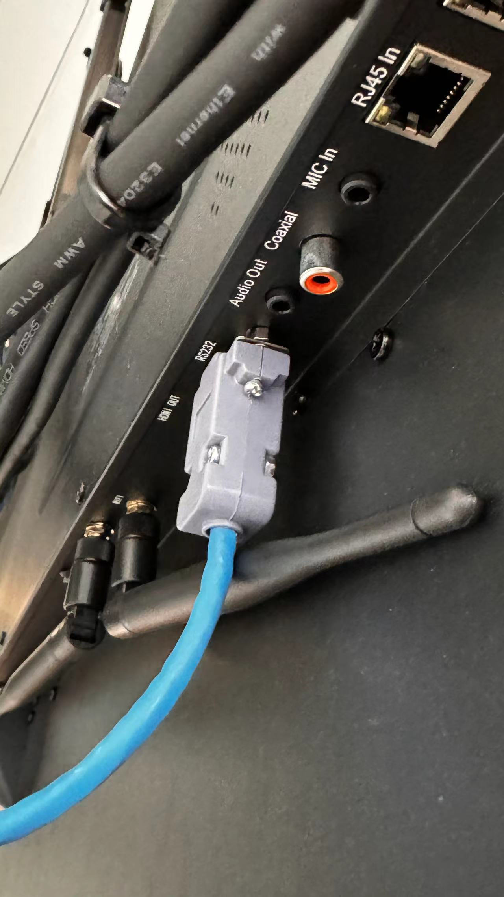

# NMP常见问题处理办法

[toc]

# 一、NMP终端

## 0). 故障检查

### 1.  NMP不工作

不工作包含：

- 指示灯不亮

- Touch Panel无法控制NMP

- Web-Console无法控制NMP

- Configtool无法找到NMP

  ...

等症状。首先要做的是重启NMP（拔掉插座断电再通电），听是否有Bee的一声响。如果没有这个声响，很可能是主控板卡故障，只能让硬件工程师介入进行售后。

 

## 1). 基础配置类

### 1. NMP无法联网（离线）

1. 尝试断电重启。拔掉NMP的电源5秒左右，重新上电开机（上线需等待1-2分钟）；
2. 检查网络是否正常，且NMP的IP地址不能与其他局域网内的设备冲突。

## 2). 广播推流类

### 1. Configtool修改Broadcast Audio

 

用Q-NEX config tool更改NMP或者MBX的Broadcast Audio配置后没有效果。

例如：从LINE AUDIO改成HDMI AUDIO，会出现AUDIO OUT有声音，SPEAKER没声音。或者两个都没声音的现象。（问题暂未解决，解决方案待定）

### 2. Broadcast 调整为HDMI后，音频广播失效

| Key  | Value                              | Remark |
| ---- | ---------------------------------- | ------ |
| 时间 | 2024-10-14 2024-11-04（更新） |        |
| 客户 | Bonnie 的客户（印尼）              |        |
| 对象 | NDP500                             |        |

**问题描述：**

Media file type for Broadcasting, video mp4 only ? for audio, what format ? becase me play ***.wav*** don’t sent to broadcast

//2025-01-15： 需要进一步问清楚客户播放声音的设备是液晶还是passive speaker还是其他的喇叭设备

**原因：**

- NDP、NMP出货之前，QC组都会通过Configtool对broadcast的通道从Line调整为HDMI，这会导致广播的时候，播放音频类的文件（如 ***.wav***), 声音无法播放.
- 若要支持Audio类播放，则需要使用Configtool重新调整为***Line Audio***, 但是这会导致广播的声音无法从IFP上的喇叭播出（但是依然可以从AUDIO OIT / SPEAKER口播出)

### 3. 广播到NMP，无声音无画面，但是直播推流正常

- 广播到nmp，无声音无画面，但是直播推流正常（媒体服务器部署在公网）直播推流正常，说明硬件设备和平台都没有问题，可排查：
  1. 如果账号下有多台nmp或者mbx设备，且分布在不同网络下，尝试广播到其他网络下的nmp上看是否正常，如果其他网络的nmp设备可以接收广播，则问题出现在该局域网下
  2. 是否局域网路由器防火墙影响广播，关掉防火墙尝试；
  3. 是否端口冲突，检查局域网内是否有其他设备使用跟qnex广播一样的端口，qnex默认广播端口12570，直播端口1935。如果端口冲突则变更端口，更改端口时，dashboard后台媒体服务器设置的端口和媒体工作站映射的端口要一致

### 4. Lite Media Server后台显示离线，无法正常广播/直播

- Lite Media Server后台显示离线，无法正常广播/直播，上传下载文件
  1. 检查网络是否连接正常，需与NMP、MBX、测试用电脑处于同一个局域网；
  2. 是否在event.qnextech.com测试；
  3. 浏览器需做安全设置 - 
     - Chrome浏览器在网址栏输入网址：chrome://flags/#block-insecure-private-network-requests
     - Edge浏览器在网址栏输入网址：edge://flags/#block-insecure-private-network-requests
     - 将’Block insecure private network requeste‘ 设置为 'Disabled‘ 

### 6. 广播出来的画面比率出现失调

#### 6.1 case 1

> 2024-12-16

 

- 断电重启设备（NMP，NDP)
  - 第一次对外接显示屏，有个参数适配的动作。

#### 6.2 case2

 

## 3). 控制类

### 1. 笔记本直连IFP没问题，但是通过NMP就会出现闪屏

> - 时间：2024-10-10
>
> - 地点：新加坡SP学校
>
> - 集成商：Chris
>
> - 问题简述：
>
>   笔记本直连IFP没问题，但是通过NMP就会出现闪屏。进一步测试 继续测试 IN 1， 2口接入有问题，IN 3口正常（ IN 1口没信号）. The same configs and settings for an input source but connected different HDMI INs will get different response, IN 3 is OK, the rest are flickering?

**根本原因：**

NMP211闪屏，是因为客户用了 **4K/30Hz HDBaseT extender (2m)** 出现了问题，后来改用HDMI Cable就没问题，(不知道为什么 IN3 正常）客户希望我们有条件也去测试一下这款兼容性问题。

**其他排除方法：**

1. 调整输出源（即笔记本）的刷新率：

    

2. 有可能是某些笔记本芯片兼容性问题，需要客户提供笔记本的芯片、芯片，电脑型号详细信息，协调借用类似的笔记本进行模拟测试复现。

### 2. RS232控制液晶失效

> - 时间：2024-10-10
> - 地点：新加坡SP学校
> - 集成商：Chris
> - 问题简述：客户反馈使用我们的RS232模块控制第三方的液晶无效。

1. 检查液晶是否开启了RS232 功能。

    

   有的液晶默认是不开启，需要工厂模式去启动它。

2. 检查Dashboard控制台的RS232代码是否正确：

    

   - 一开始发现控制码是不对，让客户联系液晶厂家提供RS232代码。
   - 教会客户识别RS232的控制码和返回码（客户一开始复制的是返回码），让客户复制控制码到RS232代码库内。
   - 按照上述步骤操作还是无法控制，则需要继续往下检查

3. 让客户现场拍照接线图，再根据图逐一检查：

    

4. 同时提供接线说明给客户

    

5. 可以让客户对调 R、T头再继续测试，经常出问题的环节也是R、T头接反了

    

    tyring switch the wires between R and T on the terminal blick

5. 如果上述都不行，则需要使用PC直连液晶，再用软件发RS232代码测试

    

    

   这种办法可以直接判断出液晶是否支持RS232控制，以及厂家提供的RS232码和波特率是否则正确。

### 3. 同一份RS232码，在系统内不同地方表现不一致（未找到根本原因）

同一份RS232代码，在“IFP”分类下无效，在“其他”分类下可以

> We spent the whole Friday trying the rs232. We powered the NMP and CPL several times and use various rs232 codes. Finally we decided to create a new listing WMR and refresh both NMP and CPL and it works!

Hi Chris, the developer previously set up an NMP at SP School for testing. Overall, it was able to send RS232 commands successfully, whether under the 'IFP' type or the 'Other' type.

(Actually, the disctinct between "IFP" and "Other" is only at the software level, from the hardware perspective, there is no much different -- just send the RS232 code with corret bound rate to the target device via RS232 port)

developer suggests firstly we can try unbinding and then rebinding the device under the 'IFP' type, and test on-site to see if the conrol works normally:

  

then, if it's unfortunately not working, you need to install an RS232 monitoring software on your laptop to check if the RS232 code is being received. 

Shown the shared picture:

  

the general process is :
1. You click the RS232 button on the CPL20 / Web-console.
2. the code will be sent to the NMP >>  CBX >> Laptop.

### 4. NMP控制液晶开机后，液晶有电但进入待机模式

1. 检查连接方式。如果只接了display口，液晶需进入工厂模式设置为上电开机模式（液晶默认上电待机模式）
2. 如果液晶RS232口没被占用，建议液晶同时连接NMP的display口和RS232，此时NMP开机后会自动给液晶供电并发送开机码实现液晶上电并开机；使用控制面板关液晶时，通过发送RS232关机码的方式，还可在Q-NEX Console设置延时断电有利于避免OPS被突然断电导致的损坏。（投影机同理，关机时需要时间散热）

## 4). 声音类

### 1. AUDIO OUT: Stereo的音源转为mono后听起来才正常

> - I believe this older NMP the audio output is mono.  We just converted our stereo 3.5mm stereo jack to mono and now the sound is correct 
>
> - Input source is from the hdmi input 1. The mono jack is connected to the AUDIO OUTPUT at the rear of the NMP
>
>    

NMP的AUDIO是立体声，可能存在接触不良的原因，客户是通过改线方式把立体声改成单声道方式解决该问题:

 

# 二、 组件

## 1). 智能面板

### 1. 智能面板无法联网

1. 检查智能面板的日期时间，需手动设置成正确日期后重新点击网络检测按钮；
2. 检查网络，比如IP地址是否处于与NMP相通的网段（校局域网），且ip地址不能与其他设备冲突；
3. 如成功联网后，需尽快将智能面板更新至最新版本

### 2. 智能面板所有功能都无反应

1. 检查Web-console是否也有类似的现象，如果Web-console也是一样的则是整套控制系统出了问题。

2. 若Web-console正常，则打开Touch Panel >> Settings >> Clear Cache & Restart Device. 然后重启Touch Panel.

3. 重新启动NMP / NPS / NDP 以及Touch Panel

4. 升级Touch Panel的版本

   > 需要网络，若无网络则需要拆卸Console的OPS到酒店等现场有网络的地方工程师远程过去存放固件包然后再返回现场给Touch Panel升级

### 3. 智能面板的DISPLAY控制无响应，但是Web-console正常

最有可能的原因是外部接电源线的线序弄错。请注意区分零线、火线和接地线的顺序。

### 4. 面板无法连接NMP / NPS / NDP 

1. 检查输入的IP地址是否NMP / NPS / NDP 的IP地址；

2. 检查面板的日期是否是当前日期（把自动勾选去年，就可以手动设置）

3. 整台NMP / NPS / NDP 断电，再上电，然后去管理后台看一下IP是否发生变动

   > 有可能是记录到上一次的

4. 使用config tool将NMP / NPS / NDP 设置为固定IP，并链接:

    

   

## 2). 麦克风

### 1. 麦克风没有声音

1. 检查NMP天线是否安装正确；
2. 检查麦克风电池是否安装且安装是否正确；
3. 检查麦克风是否与NMP配对成功（配对时需尽可能的靠近天线，出厂时麦克风已与NMP一一配对）
4. 如配对成功，麦克风开机的情况下，NMP前置面板的灯会亮起
5. 检查NMP是否已连接音箱 或者 接个耳机到NMP的MIC OUT口监听麦克风讲话时是否有声音

## 3). CBX

### 1. CBX不明原因掉线 / 不稳定

1. 检查NMP / NDP的天线是否安装，尤其是NMP的两根2.4G Wi-Fi天线是否安装。

    

   有时候用户会混淆2.5G Wi-Fi天线和 UHF无线麦克风天下。（新加坡SP学校）

2. 重启CBX，刷新Dashboard观察是否恢复，若无法恢复继续重新NMP / NDP

3. 确保DIP开关在系统内是唯一的 

### 2. NMP重启后CBX需要重新拔插连接⚠️

NMP主电源关机再开机之后，CBX需要重新拔插才可以链接。（2023-12）

### 3. DIP发生变更，UI不会正确刷新(非问题)

CBX拨号发生变动之后，UI页面不会更新。如CBX1播放改成CBX3， UI上CBX1、3都显示在线，实际上只有CBX3在线。

正常流程：

1. CBX先断电，让NMP知道CBX离线
2. 然后将这个CBX拨片再与NMP重新连接
3. 最后将这个拨片后的CBX上线，让NMP知道拨片后CBX上线了

## 4). 工具类

### 1. Config tool找不到设备

> 2024-12-14 蒙古客户
>
>  

1. 不推荐使用液晶的OPS
2. 推荐使用笔记本，并且笔记本使用有线LAN Cable和设备（NMP，NDP）处于同一个网段。且**暂时禁用笔记本的Wi-Fi**。

# 三、 平台

## 1). Dashboard

### 1. Q-NEX后台添加设备失败

1. 检查要添加的设备ID是否正确或是否已在组织里
2. 将要添加的设备ID发给道秀查询

### 2. Dashboard的RS232码库没有QA1300类别？

 

#### s1: 确定该机型是标准款还是项目款

1. QA1300是项目款，项目款我们通常不导入到系统库。
2. QA1300pro 才是项目款，该款的RS232代码和TB1300一样。可以考虑让客户使用pro的代码，如果客户不答应，则我们这边联系厂家要一份RS232代码让客户自己手动添加

> 原因：TB/QA1300 ***Pro***是标准款，TB/QA1300是项目款，我们IQ库只维护标准款机型，项目款太多了，每个月都有好几个项目款出现，维护不过来的，且项目款的RS232和标准版RS232一样，让客户需要的话可以直接选择对应的标准款就好，如果客户不想要这个机型名称选项，那就只能让他自己后台添加，我们不做处理

#### s2: 确定生产系统是系统库还是手动添加

 

- 在Serial Code Management菜单下，Actions菜单不可以删除的就是系统库，否则就是非系统库
- 系统库是全局shared的，即全球所有客户都可以看到并选择这个RS232码库；非系统的则只有该账号下的组织可以查看选择。
- 若已确认该机器（如 QA1300 Pro) 是系统库，则应该通知测试组进行校验RS232是否准确，校验无误则通知开发转入系统库。

# References

1. [smb://192.168.10.168/IQ-国际事业部/6.小奇智联项目部/1.部门共享/2.一些售前资料/Q-NEX售前资料](smb://192.168.10.168/IQ-国际事业部/6.小奇智联项目部/1.部门共享/2.一些售前资料/Q-NEX售前资料)