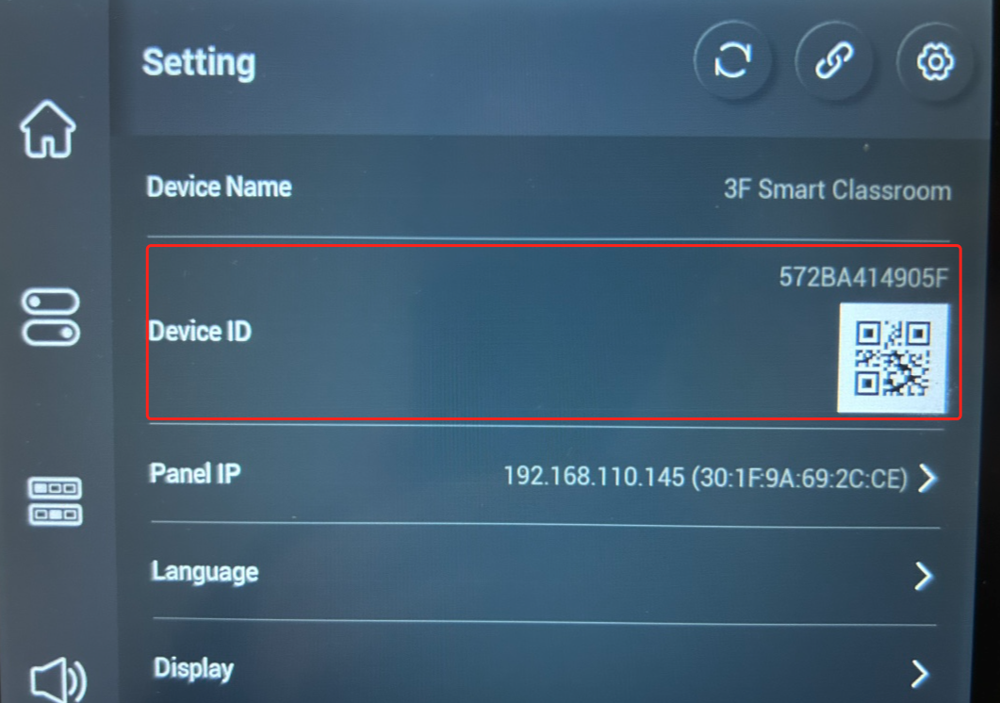
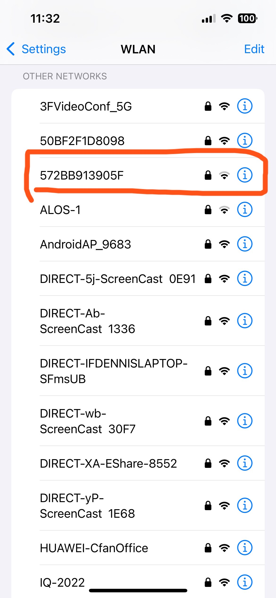
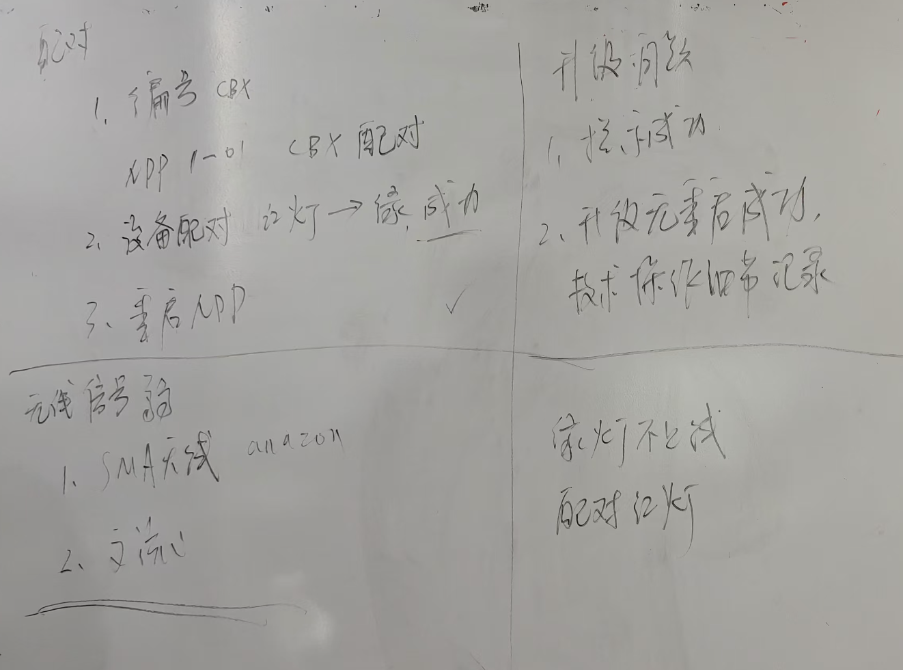

# 陈利-无缝矩阵故障报告专题

[toc]

### CBX与稳定性问题

t seems as though the rooms that were used had issues.  I went to every room again today and here is the status.

- 210 not pairing CBX issue- was working 
- 211 stopped working, button fix- tried to pair, not pairing with cbx that was working
- 209b seems good
- 209a - new 98 tv, can’t test, cbx has not been tested but paired.
- 212- cbx was not working, I put in an ir directly from unit, need to replace cbx Cbx would not pair
- 205- cbx would not pair - took cbx from room

3rd floor

- 302 is good
- 300A President br, tv cbx not working anymore but still paired- going to reprogram button again, the cbx is green but not showing up in the portal, tv power not working —trying to reboot to gain control , rebooted cbx and system, started working, not reliable Tv on off ir code seems to not be working, capture ir code specific to room and started working, I will test again tomorrow.
- 311 - back tv cbx stopped working, had to reboot, light was green but not working, projector not controllable , tried, cbx, straight IR, and the RS232 was working and stopped after updates, screen up down stopped working today, had to reboot, mic has some noise

1st floor

- 110 pilot room- seems to be good, no matrix in this room
- 107c- working but just put in cbx this morning, check in am
- 109 - projector not working 

Student union 

- 204 working
- 205 - working, cbx won’t pair
- 109 - projector not working 
- 311 - back tv cbx stopped working, had to reboot, light was green but not working, projector not controllable , tried, cbx, straight IR, and the RS232 was working and stopped after updates, screen up down stopped working today, had to reboot, mic has some noise

### 主要问题总结

1. **CBX 无法配对或配对失败**
   
   - **Room 205**：CBX正常工作，但无法配对。
   - **Room 210**：CBX无法配对（之前是正常工作的）。
   - **Room 211**：尝试配对，但CBX无法与NDP500配对。
   - **Room 212**：CBX无法工作，建议更换CBX。
   - **Room 205（再次提到）**：CBX无法配对。
   
2. **CBX 配对成功但掉线或不稳定**
   
   - **Room 300A**：CBX绿灯亮，但无法在系统中显示；电视开关控制不正常，需重启后恢复，但整体系统表现不稳定。
   - **Room 311**：CBX绿灯亮但无法工作；投影仪不可控，尝试CBX、直连IR和RS232都有效，但更新后停止工作；屏幕上下控制失效，需要重启恢复；麦克风有噪音。
   
3. **设备控制功能异常**
   
   - **Room 109 (NMP)**：投影仪无法工作。**[RS232]** 一开始正常，升级固件不行。
   
     //使用laptop工具观察是否有发出来。
   
   - **Room 311 (NMP)**：投影仪无法控制，尝试多种方式后（包括IR和RS232）都无效。
   
   - **Room 300A 和 311**：电视的开关红外控制功能异常，需重新捕获IR码才能正常工作。
   
   - **Room 311**：投影仪和屏幕上下控制失效，更新后恢复需要重启。
   
4. **设备稳定性差，需频繁重启**
   - **Room 300A**：系统不可靠，需重启CBX和系统。
   - **Room 311(NMP)**：系统更新后，设备功能失效，需重启恢复。
   - **Room 212**：CBX无法工作，需更换CBX。
   
5. **音频问题**
   - **Room 311**：麦克风有噪音。

总结

- **CBX 配对和功能问题**：多个房间的 CBX 都无法成功配对或配对后功能不稳定，需要频繁重启。
- **控制功能失效**：如投影仪和屏幕控制功能不稳定，特别是在 Room 311 和 Room 109，部分设备无法通过预定的方式控制（IR、RS232）。
- **设备需要更换**：如 Room 212，建议更换 CBX。
- **音频问题**：Room 311 存在麦克风噪音问题。

#### 答复客户

我们已经尝试升级过了几次，但是鉴于跨国际网络的稳定性，我们还会让工程师进行一次升级。

关于CBX无法配对的问题，我们初步推测，也有可能存在某个CBX已经被其他教室的NDP500配对，导致无法成功配对当前的NDP500，为解决这个问题，可以进行如下尝试：

1. 对NDP进行重启，且要等待NDP重启成功之后（CPL20能接入这台NDP500）
2. 请确保NDP先重启成功，然后再去重启CBX。否则会出现CBX无找到NDP。
3. 使用Pin工具对CBX进行重置，再重新尝试配对。

Hi, I’m Lee, the Product Manager for NDP500. I want to sincerely apologize for the challenges you’ve experienced.

We've tried upgrading the system a few times, but due to international network stability, we’ll have our engineers perform another upgrade.

Regarding the CBX pairing issue, we suspect that some CBX units might already be paired with another room's NDP500, causing the pairing to fail. To address this, please try the following steps:

1. Restart the NDP500 and ensure it fully boots up (CPL20 should connect to this NDP500).
2. Once the NDP500 has restarted successfully, then restart the CBX. Starting the CBX before the NDP500 might cause it to fail to find the device.
3. Use a pin tool to reset the CBX and try pairing again.

----

We’ll have our engineers perform another upgrade due to network stability concerns.

For CBX pairing issues, please try:

1. Restart the NDP500 and wait for it to fully boot (CPL20 connected).
2. Restart the CBX after the NDP500 is ready.
3. Use a pin tool to reset the CBX and re-pair.

#### 升级邮件

Hi guys,

I’ve arranged for our engineers to upgrade the following devices. 

- **Room 205**： （
- **Room 210**：
- **Room 211**：
- **Room 212**：
- **Room 205(Student union )**

During the upgrade, **please ensure the network remains stable and avoid any additional operations**—this is very important.

As batch upgrades are not permitted due to the safety reasons, engineers will upgrade the devices one by one, the whole process expectes to last about 15-20 minutes.

Will notify once the upgrade is complete.

| No.  | Room                     | Device ID    |
| ---- | ------------------------ | ------------ |
| 1    | 205                      | 572BAA14905F |
| 2    | 210                      | 572B8D11905F |
| 3    | 211                      | 572BE914905F |
| 4    | 212                      | 572BB611905F |
| 5    | 205 (Student union) | 572B8F11905F |

### 电容笔能否平替

> Guys can the customer use other stylus on the podium unit. Is that a Wacom type pen. They want to know if instructors can have thier own stylus or can they get a compatible pen. 

1. MPP（Microsoft Pen Protocol）是微软的一种数字笔协议，用于支持触摸屏设备与数字笔之间的互动。
2. Wacom 生产的数字笔通常采用的是 Wacom 自有的协议，而不是 MPP 协议。不过Wacom 的一些新型号，它们可能同时支持 MPP 协议、Wacom 协议以及其他第三方协议。
3. 你可以跟用户提一提 Surface（微软平板）那个笔是可以用，Wacom的需要看能否支持 MPP，如果支持可以用，但是由于缺少出厂前的调试校验，可能用起来没那么流畅

## 会议过程

1. 需要确认2楼的是否有重启过
2. 有让客户拿其他地方的CBX进行测试，然后反馈不行
3. 做一个检查清单交给客户

### 排查步骤建议

Hi Don,

Hope this email finds you well & your another project is going smoothly.

We are doing fully test for the new CBX units that going to send to your side, these units will send out to you before our traditional vacation ***(Chinese New Year, from Jan 25 to Feb 4)\***

What's more, we want collect some detail information about the failed CBX units (**Need you fill or clarify the yellow area in the following table**) :

**CBX Problems Collection：**

| No.  | S/N  | Room              | Phenomenon             | CBX Function       | CBX Light                       | Can see CBX in QNEX console or not | What the device that CBX gonna work with |
| ---- | ---- | ----------------- | ---------------------- | ------------------ | ------------------------------- | ---------------------------------- | ---------------------------------------- |
| 1    |      | Adams 205         | CBX cannot work        | Control Projector? | Red or green or No light at all | Yes or No                          | NDP500                                   |
| 2    |      | Student Union 205 | CBX cannot work        | Control Projector? | Red or green or No light at all | Yes or No                          | NDP500                                   |
| 3    |      | Health            | CBX cannot work        | Control Projector? | Red or green or No light at all | Yes or No                          | NDP500                                   |
| 4    |      | Unknown           | TV Control cannot work | Control TV?        | Red or green or No light at all | Yes or No                          | NMP                                      |
| 5    |      | Unknown           | TV Control cannot work | Control TV?        | Red or green or No light at all | Yes or No                          | NMP                                      |

Thanks a lot in advance.

### Wi-Fi模块排查

**Subject:** Follow-Up: Additional Wi-Fi Module Check for NDP500

Hi Don,

I’d like to add one more quick check to rule out any potential issues with the internal Wi-Fi module of the NDP500:

1. When you’re onsite,  please check if the NDP500's Wi-Fi antenna is broadcasting by your phone. Normally, after the device boots up, it will generate a Wi-Fi signal named after its **Device ID** 

   - You can find the  **Device ID** in two places:

     - On the **Touch Panel**: Go to **Settings > Device ID**. 

         

       or

     - On the label attached to the back of the NDP500 unit.

2. On your phone’s WLAN settings, please look for a Wi-Fi signal with this **Device ID** name and note the signal strength.

    

This will help us confirm if the internal module is working as expected. Let me know what you find. Thanks again for your patience and assistance!

Best regards,
Lee 
Product Manager, NDP500

## 后续产品迭代改进计划

 